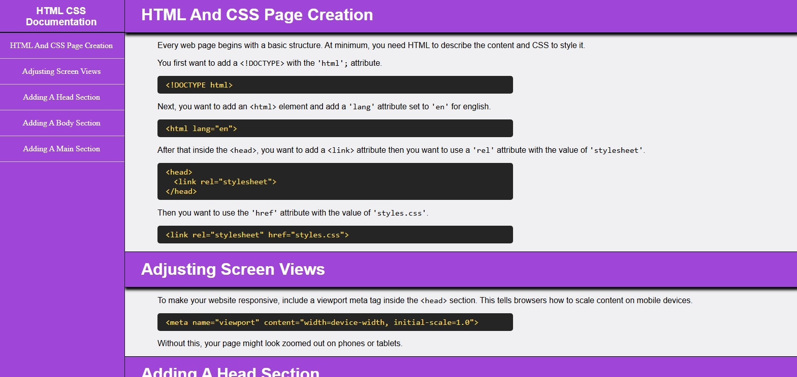

# 📘 Technical Documentation Page

## 📖 Overview
This project is part of my FreeCodeCamp Responsive Web Design certification.
The objective was to build a technical documentation page using only HTML and CSS.

The page serves as a beginner-friendly reference for creating and structuring a simple website with HTML and CSS. It demonstrates semantic elements, layout techniques, and responsive design principles.

## ✨ Features
- Fixed side navigation bar for quick access to sections.
- Responsive layout that adapts to desktop and mobile screens.
- Multiple documentation sections with code examples.
- Highlighted code blocks styled with monospace font.
- Clean typography and consistent color scheme.
- Hover effects on navigation links for better interactivity.
- Footer with developer credit and external link.

## 🛠️ Built With
HTML – semantic structure and documentation content

CSS – styling, layout, navigation, and responsive design.

## 🧰 Skills Demonstrated
- Semantic HTML structuring
- Responsive design with CSS media queries
- Fixed-position navigation layout
- Clean code formatting and commenting
- Project documentation writing

## 🚀 How to Use
<a href="https://midnight-developer-ts.github.io/technical-documentation-page/">Click here to view the project</a>

Or clone/download this repository and open index.html in your browser.

1. Use the navigation bar to jump between documentation sections.
2. Read through code examples and explanations for each HTML/CSS concept.
3. Resize the browser window to see responsive adjustments.

## 📂 Project Structure
technical-documentation-page/

│── index.html # main webpage

│── css/

│ └── styles.css # styling

│── images/

│ └── website-favicon.png # favicon

│ └── website-preview.jpeg # preview image

│── README.md # project details

## 📌 Learning Goals
- Built a multi-section documentation page with semantic structure.
- Used semantic HTML elements like &lt;main&gt;, &lt;section&gt;, &lt;nav&gt;, and &lt;footer&gt;.
- Implemented a fixed-position sidebar navigation with CSS.
- Applied responsive design techniques using media queries.
- Styled inline code snippets and blocks for readability.

## 🎯 Certification Project Requirement Checklist

This project was built to meet the user stories for the FreeCodeCamp Responsive Web Design – Technical Documentation Page certification project:

1. ✅ A main element with id="main-doc" contains the page’s main content.
2. ✅ At least five &lt;section&gt; elements with the class main-section.
3. ✅ The first element in each .main-section is a header describing the topic.
4. ✅ Each .main-section has an id matching its header text (spaces replaced with underscores).
5. ✅ There are at least 10 &lt;p&gt; elements total across sections.
6. ✅ There are at least 5 &lt;code&gt; elements total across sections.
7. ✅ There are at least 5 &lt;li&gt; list items total across sections.
8. ✅ A nav element with id="navbar" is present.
9. ✅ The navbar contains a header describing the documentation topic.
10. ✅ The navbar contains link (a) elements with class nav-link, one for each .main-section.
11. ✅ The header in the navbar appears before the links.
12. ✅ Each .nav-link text matches the corresponding section header.
13. ✅ Clicking a .nav-link scrolls to the corresponding section in #main-doc.
14. ✅ On larger devices, the navbar is fixed on the left side of the screen and remains visible.
15. ✅ At least one media query is used for responsive design.

✅ All the FreeCodeCamp requirements are complete, and the project works as expected.

## 📸 Preview
